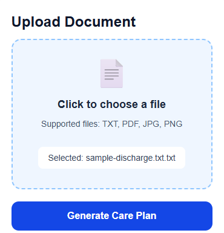
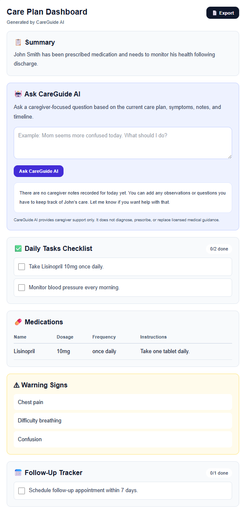
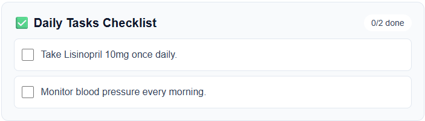
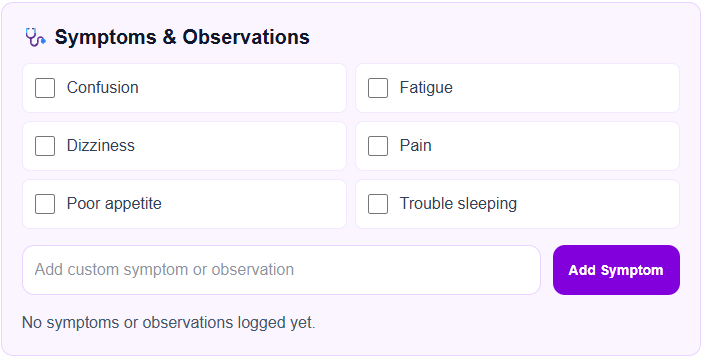
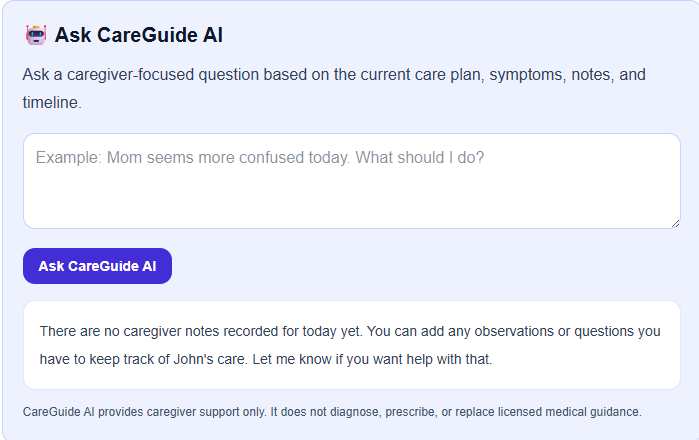
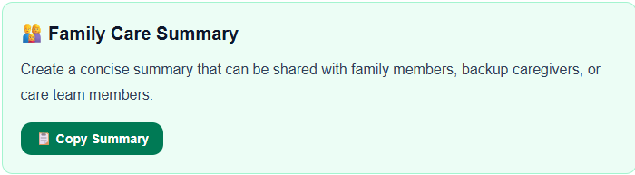

# 🩺 CareGuide AI

> Transforming complex healthcare documents into caregiver-friendly action plans and care coordination tools.

## 🎯 Overview

CareGuide AI is an AI-powered caregiver support platform designed to help family caregivers better understand discharge instructions, medication lists, care plans, and healthcare documents.

The platform analyzes uploaded documents and generates clear, actionable care plans while providing tools for ongoing care coordination, symptom tracking, follow-up management, family communication, and caregiver documentation.

Built as a submission for the ACL (Administration for Community Living) Caregiver AI Challenge – Track 1: AI Tools to Support Caregivers.

---

## 🚀 Current Features

### 📄 Document Processing

* TXT document upload
* PDF document upload
* JPG image upload
* PNG image upload
* PDF text extraction (PyMuPDF)
* Image OCR processing (Tesseract OCR)

### 🤖 AI Care Plan Generation

* OpenAI-powered care plan creation
* Caregiver-friendly summaries
* Daily task extraction
* Medication identification
* Warning sign detection
* Follow-up recommendations
* Structured JSON responses

### 📋 Caregiver Dashboard

* Patient care summary
* Medication management table
* Daily task checklist
* Progress tracking
* Follow-up appointment tracker
* Warning signs monitoring

### 🩺 Care Coordination Tools

* Symptom & observation tracking
* Custom symptom logging
* Caregiver notes
* Care timeline/history
* Follow-up tracking
* Family care summary generation

### 👨‍👩‍👧 Family Caregiver Support

* Family care summary sharing
* Copy-to-clipboard summary export
* Care coordination support
* Provider-ready care summaries

### 📄 Export Features

* Care summary PDF export
* Printable caregiver dashboard

---

## 📸 Application Screenshots

### Upload & Document Processing



Upload discharge instructions, medication lists, PDFs, or images for AI-powered analysis.

---

### Care Plan Dashboard



CareGuide AI converts complex healthcare documents into caregiver-friendly summaries, medications, warning signs, and follow-up actions.

---

### Daily Task Checklist



Interactive caregiver task management helps ensure important care activities are completed and tracked.

---

### Symptom & Observation Tracking



Caregivers can log symptoms, observations, and monitor changes over time.

---

### AI Caregiver Assistant



Context-aware caregiver support powered by AI. The assistant uses the generated care plan, symptoms, notes, and timeline to answer caregiver questions while maintaining safety guardrails.

---

### Family Care Summary



Generate shareable summaries for family members, backup caregivers, and care team coordination.

---

## 🏗 Architecture

```text
Caregiver
    ↓
Next.js Frontend
    ↓
FastAPI Backend
    ↓
PDF / OCR Processing
    ↓
OpenAI Analysis
    ↓
Structured Care Plan
    ↓
Interactive Caregiver Dashboard
```

---

## 🎯 ACL Challenge Alignment

Track 1: AI Tools to Support Caregivers

CareGuide AI directly supports:

* ✅ Care Coordination & Navigation
* ✅ Caregiver Education
* ✅ Documentation & Tracking
* ✅ Decision Support
* ✅ Family Caregiver Communication
* ✅ Shareable Care Summaries
* ✅ Follow-Up Management
* ✅ Symptom Tracking & Monitoring

---

## 🛠 Technology Stack

### Frontend

* Next.js
* React
* TypeScript
* Tailwind CSS

### Backend

* FastAPI
* Python

### AI

* OpenAI API

### Document Processing

* PyMuPDF
* Tesseract OCR
* Pillow

---

## 📂 Project Structure

```text
acl-caregiver-ai/
│
├── README.md
├── backend/
├── frontend/
│
├── docs/
│   ├── caregiver-personas.md
│   ├── user-stories.md
│   ├── evaluation-plan.md
│   ├── phase2-testing-plan.md
│   ├── acl-submission-outline.md
│   └── screenshots/
│
└── .gitignore
```

---

## ⚙️ Backend Setup

### Create Virtual Environment

```powershell
cd backend

python -m venv venv

.\venv\Scripts\activate
```

### Install Dependencies

```powershell
python -m pip install -r requirements.txt
```

### Configure Environment Variables

Create:

```text
backend/.env
```

Add:

```env
OPENAI_API_KEY=YOUR_API_KEY_HERE
```

### Start Backend

```powershell
uvicorn app.main:app --reload
```

Backend API:

```text
http://127.0.0.1:8000
```

Swagger Docs:

```text
http://127.0.0.1:8000/docs
```

---

## 💻 Frontend Setup

```powershell
cd frontend

npm install

npm run dev
```

Frontend:

```text
http://localhost:3000
```

---

## 🔒 Security

The following are excluded from source control:

* `.env`
* Python virtual environments
* Node modules
* Next.js build artifacts
* Upload directories
* Generated files and caches

---

## 📈 Project Status

### Phase 1 — Completed ✅

* Document Upload
* PDF Extraction
* OCR Processing
* AI Care Plan Generation
* Structured JSON Care Plans

### Phase 2 — Completed ✅

* Interactive Caregiver Dashboard
* Daily Task Checklist
* Medication Management
* Follow-Up Tracking
* Symptom Tracking
* Caregiver Notes
* Care Timeline
* Family Care Summary
* PDF Export

### Phase 3 — Completed (Initial Release) ✅

* AI Caregiver Assistant
* Context-Aware Caregiver Support
* Human-in-the-Loop AI Design
* Care Context Integration
* Timeline-Based AI Interaction Logging

### Future Enhancements 🚀

* Suggested Questions
* Conversation History
* FHIR / EMR Integration
* Community Resource Recommendations
* Multi-Caregiver Collaboration

---

## ⚠ Disclaimer

CareGuide AI does not provide medical advice, diagnosis, or treatment recommendations.

The platform is intended to help caregivers better organize and understand healthcare information. Users should always consult qualified healthcare professionals regarding medical decisions.

---

## ❤️ Mission

Family caregivers spend countless hours interpreting discharge instructions, medication lists, and healthcare documents.

CareGuide AI aims to reduce caregiver burden by transforming complex medical information into simple, actionable care plans while improving care coordination, communication, confidence, and quality of care for individuals receiving support at home and in their communities.
